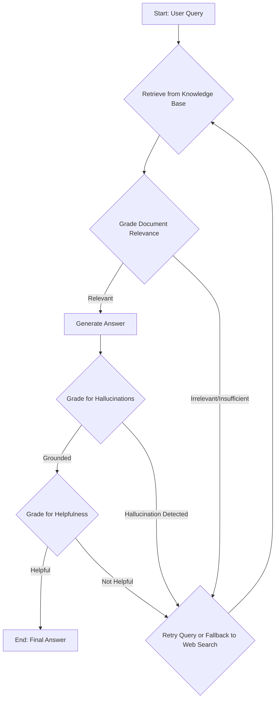
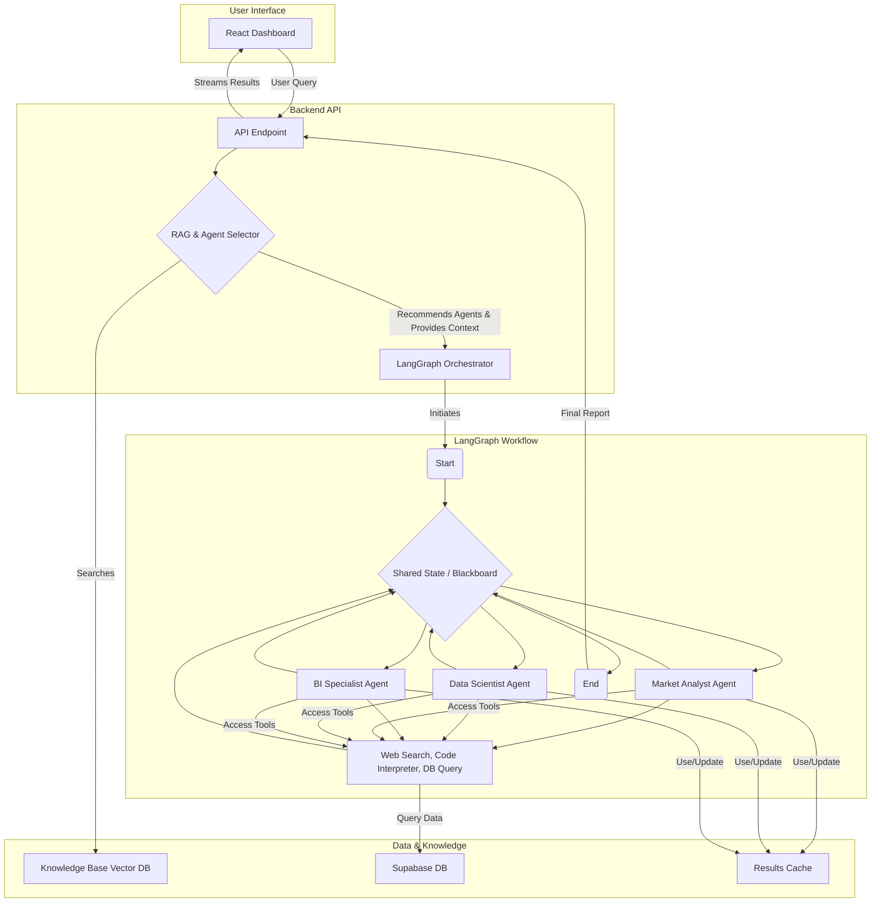

### **Architecting Multi-Agent Framework**

**Target Audience:** Product Owners, Backend/Frontend Developers, Business Intelligence Analysts, Data Engineers, Data Scientists.

---

#### **Title Slide**

*   **Title:** Architecting Intelligence: A Multi-Agent Framework for Marketing Research
*   **Subtitle:** Powered by AI Agents, Advanced RAG, and Contextual Engineering
*   **Presenter:** Senior Software Developer & Marketing Intelligence Specialist
*   **Date:** September 11, 2025

---

#### **Agenda**

1.  **The Opportunity:** Redefining Marketing Research with AI
2.  **Core Concepts:** A Primer for a Mixed Audience
    *   AI Agents & Multi-Agent Systems (CrewAI vs. LangGraph)
    *   Retrieval-Augmented Generation (RAG)
    *   Context Engineering
3.  **Project Architecture:** A Deep Dive Under the Hood
4.  **Key Innovations in Our Project**
    *   Integration of RAG and Agent Selection
    *   Context Engineering in Action
5.  **Features & Business Impact:** The Value Proposition
6.  **Q&A**

---

#### **The Opportunity: Beyond Traditional Marketing Research**

*   **The Problem:**
    *   Traditional market research is often slow, manual, and costly.
    *   Data is vast and siloed (social media, sales figures, reports, web analytics).
    *   Synthesizing this data into a single, actionable narrative is a major challenge.
*   **Our Solution:**
    *   An autonomous system of specialized AI agents that collaborate to perform complex research tasks.
    *   It mimics a human research team, but operates at machine speed and scale.
    *   **Goal:** Move from data reporting to predictive and prescriptive insights.

---

#### **Core Concept 1: What is an AI Agent?**

*   **Definition:** An AI system that uses a Large Language Model (LLM) as its core reasoning engine to perceive its environment, make decisions, and take actions to achieve a goal.
*   **Key Components:**
    *   **LLM (The Brain):** For reasoning, planning, and natural language understanding (e.g., GPT-4, Gemini).
    *   **Tools (The Hands):** Functions the agent can call to interact with the world (e.g., web search, code execution, database queries).
    *   **Memory (The Notebook):** Short-term and long-term storage to maintain context and learn from past interactions.

---

#### **Core Concept 1.1: The Multi-Agent Framework Landscape**

*   **What is it?** A system where multiple specialized agents work together, communicate, and delegate tasks to solve a problem more complex than any single agent could handle alone.
*   **Our Choice:** We chose **LangGraph** for two key reasons: its flexibility to model complex, cyclical research workflows, and its seamless integration with **LangSmith**, a platform for robust debugging, tracing, and monitoring of agent interactions.

*   **Comparison of Popular Frameworks:**

| Provider / Framework | Analogy | Pros | Cons |
| :--- | :--- | :--- | :--- |
| **CrewAI** | **A well-defined corporate hierarchy.** | High-level, role-based, and easy to set up. Great for rapid prototyping and clear, hierarchical workflows. | Can be rigid. Less granular control over task execution and agent communication flow. |
| **LangGraph** | **A flexible project team on a whiteboard.** | Highly flexible, supports complex cycles, branching logic, and explicit state management. Excellent for research and complex problem-solving. | Steeper learning curve; requires more boilerplate code to define the workflow graph. |
| **Microsoft AutoGen** | **A university research group.** | **Highly Versatile & Research-Oriented:** Excellent for creating complex conversational agents that can self-correct and learn. Great for R&D. | **Complexity:** Can be complex to set up and manage for simple production use cases. Less opinionated, requiring more architectural decisions. |
| **AWS Bedrock Agents** | **A corporate IT department.** | **Integration & Security:** Deeply integrated with AWS services (Lambda, S3, etc.). Strong focus on enterprise-grade security, governance, and model choice. | **Framework Lock-in:** Primarily designed to work within the AWS ecosystem. Can be less flexible than open-source frameworks. |
| **Google Vertex AI** | **A corporate data science division.** | **Powerful Grounding & Search:** Leverages Google's world-class search and data infrastructure to ground agents in reliable information, reducing hallucinations. | **Nascent Tooling:** The agent-building ecosystem and tools are powerful but still evolving compared to more mature, specialized frameworks. |
| **OpenAI Assistants API** | **A highly skilled personal assistant.** | **Simplicity & Power:** Extremely easy to get a powerful, tool-enabled agent running. State management is handled automatically. | **Limited Orchestration:** Natively designed for single-agent use. Creating a true multi-agent system requires building a custom orchestration layer on top. |

*   **Recommendations:**

    *   **For Startups & Rapid Prototyping:**
        *   **Recommendation:** Start with **CrewAI** or **OpenAI Assistants API**.
        *   **Why:** Fastest time-to-value. Allows you to validate your core idea without getting bogged down in complex orchestration logic.

    *   **For Academic Research & R&D Teams:**
        *   **Recommendation:** Use **Microsoft Autogen** or **LangGraph**.
        *   **Why:** These offer the most flexibility and control to experiment with novel agent designs, communication patterns, and complex, cyclical workflows.

    *   **For Large Enterprises:**
        *   **Recommendation:** Build on **AWS Bedrock** or **Google Vertex AI**.
        *   **Why:** These platforms provide the necessary security, scalability, data governance, and integration with existing cloud infrastructure that are critical for enterprise adoption.

    *   **For Complex, Custom Workflows:**
        *   **Recommendation:** **LangGraph** is the ideal choice.
        *   **Why:** When your process isn't a simple hierarchy and requires dynamic loops, human-in-the-loop validation, and fine-grained state control, LangGraph provides the necessary power and flexibility.

---

#### **Core Concept 2: From Standard RAG to Self-Correcting RAG**

*   **What is RAG?** Retrieval-Augmented Generation is a technique to make LLMs smarter and more reliable by connecting them to external, private knowledge bases.

*   **Standard RAG (The Junior Researcher):** A simple, linear process.
    1.  **Retrieve:** Finds the first relevant documents it can.
    2.  **Augment:** Adds them to the prompt without question.
    3.  **Generate:** Gives an answer based on that initial context.
    *   ***Limitation:*** *It inherently trusts the initial retrieval. If the documents are irrelevant, outdated, or don't contain the answer, the LLM may guess, "hallucinate," or simply fail.*

*   **Our Innovation: Self-Correcting RAG (The Senior Researcher):**
    *   Our system introduces a crucial, cyclical validation loop. It doesn't just retrieve; it **assesses, grades, and refines.**

*   **The Key Advantages of Self-Correction:**
    *   **Accuracy & Reliability:** By grading for hallucinations, the system ensures answers are factually grounded in the provided sources. This moves from "plausible-sounding" to "verifiably accurate."
    *   **Resilience & Robustness:** It doesn't fail on a poor initial search. The system can autonomously rewrite queries, retry, and even pivot to a web search if the internal knowledge base is insufficient.
    *   **Expanded Knowledge:** The web search fallback allows the system to answer questions about recent events or topics not covered in the static knowledge base, providing comprehensive and timely insights.

---

#### **Core Concept 3: Advanced Context Engineering**

*   **What is it?** The science of aggressively optimizing the information (the "context") fed to an LLM to maximize performance and minimize cost. It's about giving each agent exactly what it needs, exactly when it needs it—and nothing more.

*   **Why it Matters:**
    *   **Cost:** LLM costs are based on token usage. A 75-85% reduction in tokens, as achieved in our system, translates directly to massive cost savings.
    *   **Performance:** LLMs have a finite "attention span" (context window). Filling it with irrelevant noise degrades reasoning quality.
    *   **Accuracy:** The right context leads to the right answer.

*   **Our Multi-Layered Context Strategy:**

| Technique | Analogy | Purpose & Impact |
| :--- | :--- | :--- |
| **Blackboard Integration** | **The Project War Room** | A central, shared space where agents post key findings. **Drastically reduces redundant work and inter-agent chat.** |
| **Context Isolation** | **"Need-to-Know" Briefings** | Each agent receives a tailored context specific to its task. The Data Analyst gets raw data; the Strategist gets the summary. **Keeps agents focused and efficient.** |
| **Context Compression** | **The Executive Summary** | Advanced, intelligent summarization and pruning of documents and conversations before they are sent to the LLM. **Directly reduces token load.** |
| **Scratchpads** | **An Agent's Notepad** | Short-term memory for an agent to jot down intermediate thoughts and reasoning steps for a single task. **Improves complex reasoning and avoids token repetition.** |
| **Checkpointing & Caching** | **Saving Your Progress** | The system saves the state and results of completed tasks. **Enables workflow recovery and provides instant results for repeated queries, saving compute and token costs.** |
| **Long-Term Memory** | **The Corporate Archives** | Using `Mem0` and `InMemoryStore`, the system retains key insights across different user sessions. **Allows the system to learn and become smarter over time.** |

*   **The Result: Aggressive Token Optimization:** Our baseline analysis required **75,000-100,000 tokens.** With this multi-layered strategy, the same task is completed with **10,000-15,000 tokens**—an **75-85% reduction.**

---

#### **Project Architecture: How It All Fits Together**

*   **Diagram Description (to be drawn on the slide):**

*   **Flow Explanation:**
    1.  User submits a research query via the **Streamlit Dashboard**.
    2.  The **RAG module** searches the **Knowledge Base** and not only retrieves data but also **recommends the best agents** for the task.
    3.  The **FastAPI backend** retrieves the data from **Supabase**.
    4.  The **LangGraph Orchestrator** starts the workflow with the recommended agents and initial context.
    5.  Agents collaborate using a **Shared State (Blackboard)**, calling **Tools** to analyze the data from **Supabase**, and using a **Cache** to store intermediate results.
    6.  The final, synthesized report is passed back to the dashboard.

---

#### **Innovation 1: RAG-driven Agent Selection**

*   **The Problem:** In a complex system, how do you know which specialist (agent) to assign to a new task?
*   **Our Solution:** We treat our agents' descriptions and capabilities as a part of our knowledge base.
*   **How it works:**
    1.  A user asks: "Analyze the ROI of our latest marketing campaign for 'Fresh' beverages."
    2.  The RAG system searches its knowledge base. It finds documents related to "ROI analysis" and "Fresh beverages".
    3.  Simultaneously, it finds that the "Data Scientist Agent" and "BI Specialist Agent" have capabilities matching these keywords.
    4.  The system instantiates a workflow with these specific agents, providing them with the relevant documents from the start.
*   **Benefit:** This creates a dynamic, context-aware, and efficient team for every unique query.

---

#### **Innovation 2: Context Engineering in Action**

*   **Shared State (The Blackboard):**
    *   Instead of passing long chat histories between agents, they write key findings to a central blackboard. New agents can get up to speed instantly by reading the blackboard, saving tokens and time.
*   **Persistent Caching:**
    *   An agent runs a complex data analysis on `beverage_sales.csv`. The result (a chart and summary) is cached.
    *   If another agent (or a future query) needs the same analysis, the result is retrieved from the cache instantly, saving significant computation and token costs.
*   **Context Pruning & Isolation:**
    *   Each agent is given only the part of the context relevant to its specific task. The Data Scientist gets the raw data file path; the BI Specialist gets the summary and chart. This keeps the context for each agent clean and focused.

---

#### **Innovation 3: Hybrid Tool Selection**

*   **The Problem:** How does an agent choose the right tool for a specific query? 
    *   **Static Approach (Inefficient):** Always running all assigned tools is wasteful and slow.
    *   **LLM-Only Approach (Expensive):** Asking the LLM to pick a tool for every query adds latency and significant cost.

*   **Our Solution: A Hybrid, Tiered Selection Strategy**
    *   We implemented a "Smart Tool Selector" that combines the best of both worlds: rule-based efficiency and query-aware intelligence.

*   **How it Works:**
    1.  **Query Analysis:** First, the system analyzes the user's query to extract keywords and intent (e.g., "forecast", "profitability", "compare brands").
    2.  **Tiered Selection:** Tools are then chosen based on a three-tier system:
        *   **Tier 1 (Essential):** Core tools for an agent's role are always selected (e.g., a `data_analyst` always needs `profitability_analysis`).
        *   **Tier 2 (Contextual):** Additional tools are selected if their keywords match the query's intent (e.g., `forecast_sales` is only chosen if the query mentions "predict" or "forecast").
        *   **Tier 3 (Supplementary):** Specialized tools are kept in reserve and are only used if the initial analysis is insufficient.

*   **Benefit: The Right Tool for the Right Job, Every Time.**
    *   This hybrid model dramatically improves efficiency by avoiding unnecessary tool executions, leading to faster response times and lower token costs, while ensuring the agent has the precise analytical capabilities needed to answer the user's query.

---

#### **Innovation 4: Intelligent SQL & Reflective Summarization**

*   **The Problem:** How can we ensure that data-heavy questions receive direct, accurate answers from our database instead of generic, qualitative responses from an LLM? Standard agent workflows often attempt the same conversational approach for all queries, leading to failure or vague answers for specific data requests.

*   **Our Solution: A Reflective, SQL-Aware Workflow**
    *   We've engineered a system that intelligently distinguishes between qualitative and quantitative queries. When a data-specific question is detected, the system bypasses standard conversational agents and routes the query directly to an intelligent SQL generation engine.

*   **How it Works:**
    1.  **Smart Query Detection:** The system first analyzes the query's intent. Keywords like "which brand," "highest revenue," or "compare performance" trigger the data-specific path.
    2.  **Direct SQL Generation:** Instead of a generic retry, the system uses an LLM with full data context (schema, column types, sample values) to dynamically generate a precise SQL query.
    3.  **Execution & Validation:** The generated SQL is automatically executed against the database.
    4.  **Reflective Analysis:** The raw data result is then passed to a summarizer agent, which combines the quantitative facts with qualitative analysis to generate a comprehensive, data-grounded answer.

*   **Benefit: From Generic Failure to Specific, Data-Driven Answers.**
    *   This approach eliminates frustrating and generic "I was unable to generate a relevant response" errors. It ensures that when a user asks a question of the data, they get a direct, accurate answer from the data itself, dramatically improving the reliability and value of our insights.

---

#### **Summary of Features**

*   **Autonomous & Collaborative Agents:** A team of specialized agents (Market Analyst, Data Scientist, etc.) that can work together.
*   **Self-Correcting RAG:** Grounded, accurate, and reliable answers from a knowledge base that can self-heal and verify.
*   **Advanced Context Engineering:** Aggressive focus on token and cost optimization through caching, shared state, and context pruning.
*   **Dynamic Agent Selection:** The right team is assembled for every query, on the fly.
*   **Intelligent & Extensible Toolset:** Agents use a powerful set of tools for analysis and data gathering, with a hybrid selection system that automatically chooses the most relevant tools for each specific query.
*   **Interactive Dashboard:** A user-friendly interface to launch research tasks, monitor progress, and view results.

---

#### **The Business Impact: Your AI Research Partner**

*   **For Product Owners & Business Leaders:**
    *   **Speed:** Reduce research time from weeks to hours. Get answers to complex business questions on demand.
    *   **Cost Savings:** Dramatically lower research costs and LLM API bills through advanced context engineering.
    *   **Deeper Insights:** Uncover hidden correlations and predictive insights that human teams might miss.
    *   **Competitive Advantage:** Make faster, more data-driven decisions to outmaneuver the competition.
*   **For Developers & Data Scientists:**
    *   **Scalable Framework:** A robust and flexible platform to build upon.
    *   **Automated Analysis:** Offload repetitive data cleaning, analysis, and visualization tasks to agents.
    *   **Focus on High-Value Work:** Spend less time on grunt work and more time on strategic interpretation and model building.

---

#### **Thank You & Q&A**

*   **Questions?**
*   **Contact Information:**
    *   Jianfeng Jin/Data Engineering Team
    *   jianfeng.jin@scanmarqed.com
